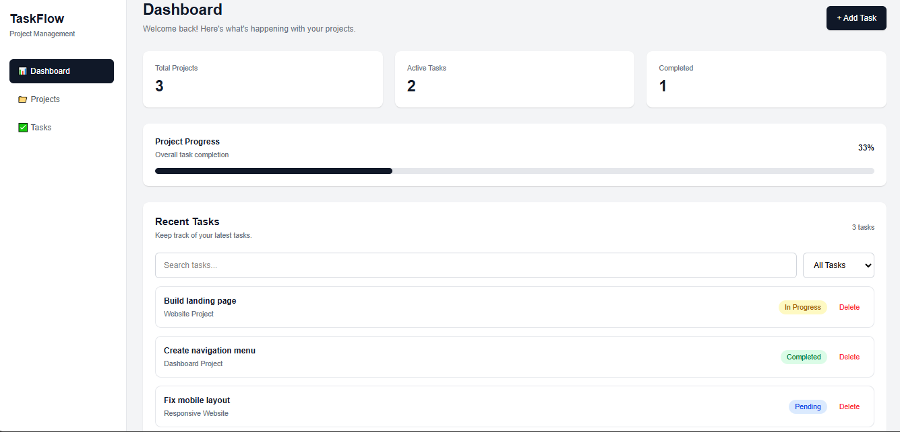

# TaskFlow

A responsive project management dashboard built with React and Tailwind CSS.

## 🚀 Features

- Responsive dashboard layout
- Task management
- Add new tasks
- Search tasks
- Filter tasks by status
- Mark tasks as completed or pending
- Delete tasks
- Dynamic task statistics
- Project progress tracking
- Local Storage persistence
- Responsive design for different screen sizes

## 🛠️ Technologies Used

- React
- JavaScript
- Tailwind CSS
- Vite
- React Hooks
- Local Storage

## 📸 Preview



## 💻 Getting Started

Clone the repository:

```bash
git clone https://github.com/maheenfat1ma/taskflow.git